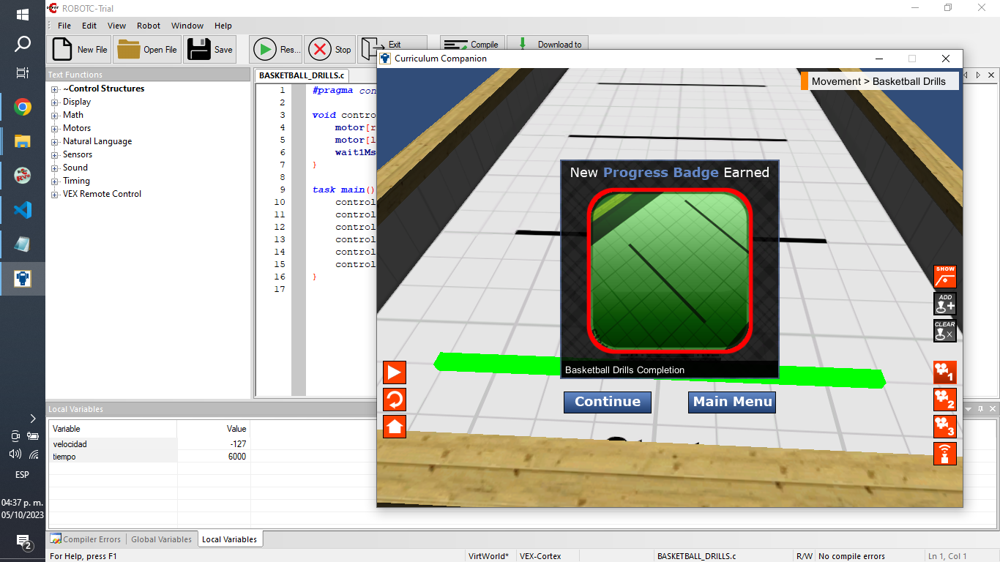
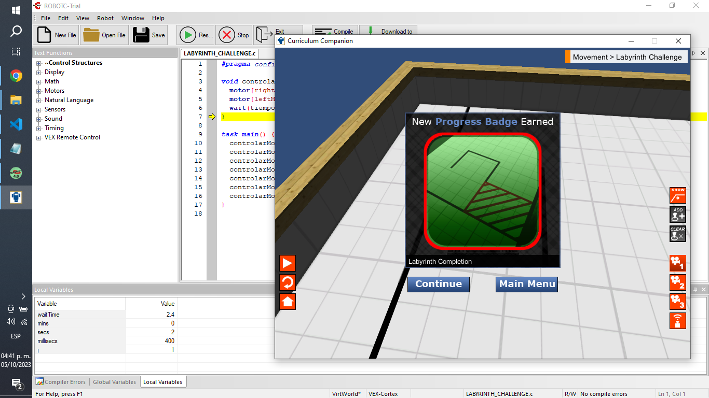
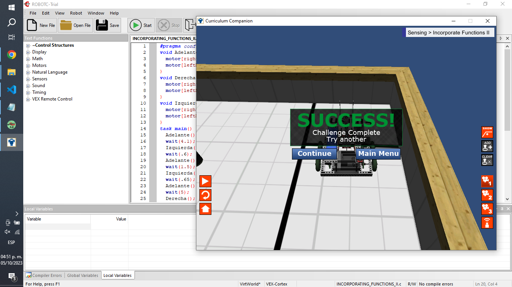
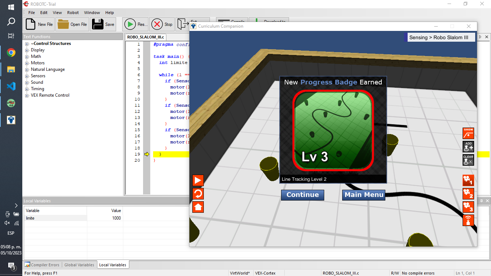
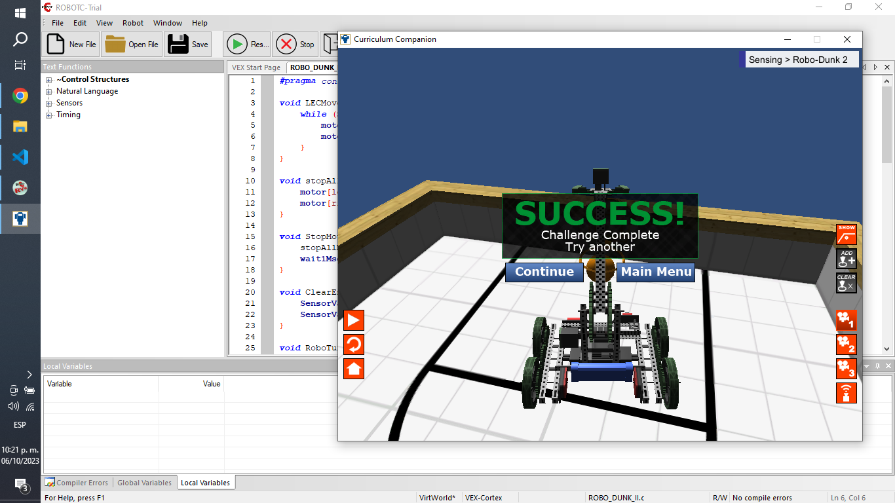

# PRÁCTICA PROGRAMACIÓN CON ROBOTC.

## Preguntas.

### 1. ¿Qué es un robot?

Un robot es una máquina autónoma capaz de detectar su entorno, realizar cálculos para tomar decisiones y realizar acciones en el mundo real.

Cuentan con las siguientes características:

- Sentido.
- Calcular.
- Actuar.

Y están diseñados para llevar a cabo una variedad de tareas, desde la manufactura y la soldadura hasta la exploración espacial y la cirugía.

### 2. ¿Qué es la robótica?

La robótica es la ingeniería y operación de máquinas que pueden realizar tareas físicas de forma autónoma o semiautónoma en nombre de un humano. Normalmente, los robots realizan tareas que son muy repetitivas o demasiado peligrosas para que un humano las realice de forma segura.

### 3. Descripción de las partes de un robot.

Las partes de un robot incluyen:

- **Cuerpo/marco:** Puede tener cualquier forma y tamaño y proporciona la estructura del robot.
- **Sistema de Control:** Coordina y controla todos los aspectos del robot utilizando sensores para proporcionar retroalimentación basada en el entorno, la CPU procesa esta información y toma decisiones basadas en la programación del robot.
- **Manipuladores:** Permiten que el robot interactúe con su entorno.
- **Tren motriz:** Permite el movimiento del robot, utilizando transmisiones que pueden variar según el tipo de robot.

### 4. ¿Cuál es la función del sistema de control?

El sistema de control gestiona, ordena, dirige o regula el comportamiento de otros dispositivos o sistemas para lograr un resultado deseado. Procesa la información de los sensores, toma decisiones en función de esa información y envía comandos a los actuadores para que el robot realice las acciones deseadas. El sistema de control es esencial para que el robot funcione de manera autónoma y pueda adaptarse a cambios en su entorno.

### 5. ¿Cuál es la clasificación de los robots?

#### Clasificación de robots según su aplicación.

- **Robots industriales:** Utilizados en líneas de montaje de fábricas, para aplicaciones como soldadura, manipulación de materiales y pintura.
- **Robots de servicio:** Realizan tareas útiles para los humanos, incluyendo robots médicos, domésticos, de defensa, de entretenimiento, agrícolas, educativos, entre otros.

#### Clasificación de robots por su cinemática o locomoción.

- **Robots cartesianos:** Tienen tres ejes lineales y se utilizan en la industria.
- **Robots cilíndricos:** Pueden moverse verticalmente y girar, utilizados en montaje y soldadura.
- **Robots esféricos:** Mueven en dirección biangular y lineal única.
- **Robots SCARA:** Utilizados para ensamblaje.
- **Robots articulados:** Con amplia gama de movimientos, usados en ensamblaje, soldadura y más.
- **Robots paralelos:** Para aplicaciones que requieren precisión.
- **Robots con ruedas y patas:** Incluyen ruedas, patas, drones y robots acuáticos, utilizados en diversas aplicaciones.

### Bibliografías.

- Guizzo, E. (2023, agosto 9). What is a robot? ROBOTS: Your Guide to the World of Robotics. https://robotsguide.com/learn/what-is-a-robot

- Keary, T., Willing, N., & Cooling, S. (2017, agosto 11). Robotics. Techopedia. https://www.techopedia.com/definition/32836/robotics

- (S/f). Revereschools.org. Recuperado el 4 de octubre de 2023, de https://www.revereschools.org/cms/lib02/OH01001097/Centricity/Domain/64/VEX%20Robotics%20Unit%202-Intro%20to%20Robotics.pdf

- (S/f-b). Electrical4u.com. Recuperado el 4 de octubre de 2023, de https://www.electrical4u.com/control-system-closed-loop-open-loop-control-system/#google_vignette

- Robots can be Classified by their Application or their Kinematics. (s/f). Designtechproducts.com. Recuperado el 4 de octubre de 2023, de https://www.designtechproducts.com/articles/classification-of-robots

## Ejercicios.

### Basketball Drills.

    #pragma config(StandardModel, "RVW SQUAREBOT")

    void controlarMotores(int velocidad, int tiempo) {
        motor[rightMotor] = velocidad;
        motor[leftMotor] = velocidad;
        wait1Msec(tiempo);
    }

    task main() {
        controlarMotores(127, 2000);
        controlarMotores(-127, 2000);
        controlarMotores(127, 4000);
        controlarMotores(-127, 4000);
        controlarMotores(127, 6000);
        controlarMotores(-127, 6000);
    }

### Labyrinth Challenge.

    #pragma config(StandardModel, "RVW SQUAREBOT")

    void controlarMotores(int velocidadDerecha, int velocidadIzquierda, float tiempo) {
        motor[rightMotor] = velocidadDerecha;
        motor[leftMotor] = velocidadIzquierda;
        wait(tiempo);
    }

    task main() {
        controlarMotores(127, 127, 2.4);
        controlarMotores(127, -127, 0.6);
        controlarMotores(127, 127, 2.9);
        controlarMotores(-127, 127, 0.6);
        controlarMotores(127, 127, 2);
        controlarMotores(-127, 127, 0.6);
        controlarMotores(127, 127, 2.4);
    }

### Incorporate Functions II.

    #pragma config(StandardModel, "RVW SQUAREBOT")
    void Adelante() {
        motor[rightMotor] = 127;
        motor[leftMotor] = 127;
    }
    void Derecha() {
        motor[rightMotor] = -127;
        motor[leftMotor] = 127;
    }
    void Izquierda() {
        motor[rightMotor] = 127;
        motor[leftMotor] = -127;
    }
    task main() {
        Adelante();
        wait(4.1);
        Izquierda();
        wait(.6);
        Adelante();
        wait(1.5);
        Izquierda();
        wait(.65);
        Adelante();
        wait(5);
        Derecha();
        wait(.6);
        Adelante();
        wait(2);
        Derecha();
        wait(.65);
        Adelante();
        wait(6.2);
        Derecha();wait(.65);
        Adelante();
        wait(3.2);
        Izquierda();
        wait(.65);
        Adelante();
        wait(2);
        Izquierda();
        wait(.65);
        Adelante();
        wait(3);
    }

### Robo Slalom III.

    #pragma config(StandardModel, "RVW SQUAREBOT")

    task main() {
        int limite = 1000;

        while (1 == 1) {
            if (SensorValue(rightLineFollower) > limite) {
                motor(leftMotor) = 127;
                motor(rightMotor) = 0;
            }
            if (SensorValue(centerLineFollower) > limite) {
                motor(leftMotor) = 40;
                motor(rightMotor) = 40;
            }
            if (SensorValue(leftLineFollower) > limite) {
                motor(leftMotor) = 0;
                motor(rightMotor) = 127;
            }
        }
    }

### Robo Dunk 2.

    #pragma config(StandardModel, "RVW CLAWBOT")

    void LECMove01() {
        while (SensorValue[leftEncoder] < 985) {
            motor[leftMotor] = 65;
            motor[rightMotor] = 65;
        }
    }

    void stopAllMotorsCustom() {
        motor[leftMotor] = 0;
        motor[rightMotor] = 0;
    }

    void StopMotorsAndWait() {
        stopAllMotorsCustom();
        wait1Msec(1000);
    }

    void ClearEncoderCounts() {
        SensorValue[leftEncoder] = 0;
        SensorValue[rightEncoder] = 0;
    }

    void RoboTurn1() {
        ClearEncoderCounts();
        StopMotorsAndWait();
        while (SensorValue[leftEncoder] < 543) {
            motor[leftMotor] = 65;
            motor[rightMotor] = 0;
        }
    }

    void RoboTurn2() {
        ClearEncoderCounts();
        StopMotorsAndWait();
        while (SensorValue[rightEncoder] < 543) {
            motor[leftMotor] = 0;
            motor[rightMotor] = 65;
        }
    }

    void RoboTurn3() {
        ClearEncoderCounts();
        StopMotorsAndWait();
        while (SensorValue[rightEncoder] < 40) {
            motor[leftMotor] = -65;
            motor[rightMotor] = 65;
        }
        ClearEncoderCounts();
        StopMotorsAndWait();
        while (SensorValue[rightEncoder] < 1100) {
            motor[leftMotor] = 65;
            motor[rightMotor] = 65;
        }
    }

    task main() {
        wait1Msec(2000);
        ClearEncoderCounts();
        LECMove01();
        StopMotorsAndWait();
        ClearEncoderCounts();

        motor[armMotor] = 23;
        wait1Msec(100);
        StopMotorsAndWait();

        motor[clawMotor] = 29;
        wait1Msec(1000);
        motor[armMotor] = 0;
        RoboTurn1();
        StopMotorsAndWait();
        motor[armMotor] = 0;
        RoboTurn2();
        StopMotorsAndWait();
        motor[armMotor] = 0;
        RoboTurn3();
        StopMotorsAndWait();

        motor[clawMotor] = -30;

        wait1Msec(1000);
    }

